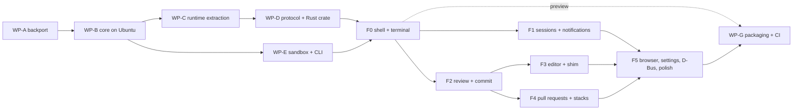

# AgentIDE on Ubuntu: work-package roadmap

Date: 2026-09-06. Implements the decisions in
`docs/superpowers/specs/2026-09-06-multi-platform-design.md` (§4–§9,
D1–D12). Baseline: HEAD `4f2855d` plus the uncommitted scaffold the design's
§2 describes. Package ids match the design's §9; surface ids (S1–S81) and
policy numbers (P1–P15) are the parity catalogue's. Sizes are engineer-weeks
for one engineer fluent in Swift and Rust with an Ubuntu 24.04 machine
beside the Mac. Bite-sized steps are deliberately absent: each package gets
its own executable plan when its predecessor lands, written against the tree
as it then is.

## WP-B: the Swift core builds and tests on Ubuntu 24.04

**Goal.** `swift build` and `swift test --filter 'AgentIDEDomainTests|AgentIDEDataTests'`
pass on Ubuntu 24.04 with swift.org's Swift 6 toolchain, the Data layer's
Linux implementations are real rather than stand-ins, and no host-side
temporary file lands in a directory the sandbox user can read.

**Scaffold.** Keeps the `#if os(macOS)` manifest gating, the six protocols,
`PlatformRoots` (fix: read the sandbox home from the passwd entry rather
than the literal at `PlatformRoots.swift:62`), `UPowerSource` (sysfs) and
`LinuxSandboxLauncher` (fixes: `detachSuffix = "& disown"`, `profileBootstrap`
sourcing `~/.profile` and `~/.bashrc`, the in-sandbox argv `[loginShell, "-c", payload]`).
Replaces `InotifyWorkspaceWatcher` (a two-second mtime poller of two levels)
with an inotify implementation. Extends the `linux-domain` CI job.

**Files.** `Sources/AgentIDEData/InotifyWorkspaceWatcher.swift` (rewrite),
`LinuxSandboxLauncher.swift`, `PlatformRoots.swift`, `NetworkMonitor.swift`
(Linux branch), `HerdrTerminalChannel.swift:48`, `SessionService+Edits.swift:134-147`,
`ConversationBackup.swift:76`, `ProcessRunner.swift:242-247`, `GitClient.swift:248-251`,
`SessionService+Overview.swift` (CPU sampling), `PullRequestStore.swift:25`,
`Sources/AgentIDEDomain/PerformanceLog.swift`, `Tests/AgentIDEDataTests/TestSupport.swift:3`,
`.github/workflows/tests.yml`.

**Interfaces.** Consumes `FileWatching`, `SandboxLaunching`, `PowerObserving`,
`ProcessRunner`, `DirectoryWake`. Produces `InotifyWorkspaceWatcher: FileWatching`
(watches the two roots, `repositories/*`, `worktrees/*` and `worktrees/*/*`,
adds watches on `IN_CREATE` of directories, coalesces 0.5 s into the same
`ChangeBox` shape), `LinuxNetworkMonitor` (default-route presence from
`/proc/net/route` plus a `getaddrinfo("api.github.com")` probe every 30 s,
"unknown reads as online" kept), `SpoolWatcher` (inotify on the edits spool
ringing `DirectoryWake`), `ProcessCPUSampler` (`/proc/<pid>/stat` utime and
stime deltas between ticks feeding `PaneLoad`), and `FoundationProcessRunner`
writing captured output under a 0700 `mkdtemp` directory in
`$XDG_RUNTIME_DIR/agentide` (Linux) or the per-user temporary directory (macOS).

**Acceptance.** CI job `linux-core` on `ubuntu-24.04` green for the Domain and
Data unit suites; the herdr-backed integration suites run against herdr's
Linux binary or are skipped by name with the reason in the job; `swift build
--static-swift-stdlib --product agentide-core` produces a binary `ldd` shows
free of `libswift*`; `strace -f -e trace=openat` of a `git` read shows no
write under `/tmp`; `PullRequestStore`'s pull request reads slow five-fold on
battery again (the scaffold's `onBattery` default regressed to `{ false }`);
the three corelibs blockers and `import Darwin` are gone from a Linux build.

**Depends on.** WP-A. **Size.** 4–6.

**First three steps.** (1) On an Ubuntu 24.04 VM: `curl -fsSL https://swiftlang.github.io/swiftly/swiftly-install.sh | bash && swiftly install latest`, then `swift build --target AgentIDEData 2>&1 | grep error:` and file the list. (2) Fix `HerdrTerminalChannel` (`readabilityHandler` feeding an `AsyncStream<UInt8>`), `SessionService+Edits` (inotify spool watcher behind `DirectoryWake`), `ConversationBackup` (`#if os(macOS)` around the ubiquity lookup, `$XDG_DATA_HOME` otherwise), `TestSupport` (`#if canImport(Darwin) … #elseif canImport(Glibc)`). (3) Move `FoundationProcessRunner`'s temporary files to a 0700 `mkdtemp` directory with a test that reads the directory's mode.

## WP-C: the reconcile loop moves into `AgentIDERuntime`

**Goal.** The poll, git-read scheduling, pull request tiers, stack rota,
placeholder rows and notification decisions live in `AgentIDERuntime`, so
both front ends receive finished `[RepositoryGroup]` values and
`NotificationDecision`s; the Mac `DashboardModel` delegates and every
`DashboardFeatureTests` case passes unchanged.

**Scaffold.** Keeps `RefreshCoalescer` and the `AgentIDERuntime` target
(`Sources/AgentIDERuntime/`). Extends it file by file from
`DashboardModel+Refresh`, `+GitReads`, `+PullRequests`, `+Stack`, `+Cache`,
`+Notifications`, `+Sessions`, `+Host`.

**Files.** `Sources/AgentIDERuntime/{AgentIDERuntime,RefreshCoalescer,Poll,GitReads,PullRequestTiers,StackRota,Notifications,Placeholders}.swift`;
`Sources/DashboardFeature/DashboardModel*.swift` shrink to view state and
delegation; `Tests/AgentIDERuntimeTests/` receives the moved tests.

**Interfaces.** Consumes `SessionService`, `PullRequestStore`, `MetadataStore`,
`FileWatching`, `PowerObserving`, `RefreshCadence`, `HerdrClient.waitForAgent`.
Produces `AgentIDERuntime.groups: AsyncStream<[RepositoryGroup]>`,
`refresh(force: Set<String>, readPanes: Bool)`, `select(worktreePath:)`,
`notifications: AsyncStream<NotificationDecision>` (`kind: finished|needsInput|output`,
repository, branch, worktree path), `status: AsyncStream<ServiceStatusChange>`.

**Acceptance.** `swift test --filter 'DashboardFeatureTests|AgentIDERuntimeTests'`
green on macOS and the runtime suite green on Linux; the Mac app's
behaviour is unchanged in the QA matrix of WP-A re-run on one OS; the
scaffold's `RefreshCoalescer` semantics (one running, one queued) are
pinned by a test.

**Depends on.** WP-B. **Size.** 3–5.

**First three steps.** (1) Move the poll loop from `DashboardModel+Refresh.swift`
into `Poll.swift` with the model calling it; run the Dashboard suite. (2) Move
`GitReadScope` scheduling and the pull request tiers. (3) Move notification
decisions, emitting `NotificationDecision`; the Mac model turns them into
`UNUserNotificationCenter` calls exactly as before.

## WP-D: the `agentide-core` protocol and the Rust protocol crate

**Goal.** `agentide-core` is a JSON-RPC 2.0 server over NDJSON on stdio
implementing the eight families in design §6.3, the events in §6.4 and the
errors in §6.5; a hand-maintained JSON Schema describes every message; a
Rust crate decodes the same fixtures the Swift side encodes.

**Scaffold.** Replaces the ad hoc `cmd`/`ok` loop in
`Sources/AgentIDECore/AgentIDECore.swift` with the envelope (`jsonrpc`, `id`,
`method`, `params`) and `core.hello`. Keeps the executable target and product
name. Hoists the feature models' direct `GitClient` and `GitHubClient` calls
behind `SessionService` first (`DashboardModel` holds `github`;
`PullRequestsModel` and `ReviewModel` read diffs and facts directly), an
upstream-neutral refactor the app's own P6 wants.

**Files.** `Sources/AgentIDECore/{Server,Envelope,Dispatch,Progress,Errors}.swift`
and `Sources/AgentIDECore/Families/{Core,Sidebar,Session,Worktree,Repository,Review,PullRequests,Edits}.swift`;
`Protocol/agentide-core.schema.json`; `Tests/AgentIDECoreTests/` (drives the
executable through pipes against a private herdr as `TestSupport` already
does); `Linux/Cargo.toml` (workspace); `Linux/crates/agentide-protocol/src/{lib,rpc,types,herdr}.rs`
and `tests/fixtures/*.json` (shared with the Swift tests by path).

**Interfaces.** Consumes `SessionService`, `PullRequestStore`, `AgentIDERuntime`,
`PlatformRoots`, `AppSettings`, `HerdrClient.attachCommand`. Produces the
methods `core.hello`, `core.roots`, `core.settings.get`, `core.settings.set`,
`core.shutdown`, `sidebar.groups`, `sidebar.refresh`, `sidebar.select`,
`sidebar.markUnread`, `sidebar.acknowledge`, `session.create`, `session.resume`,
`session.resumePast`, `session.resumeInNewWorktree`, `session.close`,
`session.kill`, `session.typeText`, `session.readOutput`, `session.attach`,
`session.stageDroppedFile`, `session.past`, `session.transcript`,
`session.deleteConversation`, `session.overviews`, `session.launchChoices`,
`session.publishChoices`, `session.probeVersion`, `session.shellEnvironment`,
`worktree.delete`, `worktree.cleanUpMerged`, `worktree.fetch`,
`worktree.fetchAndReset`, `worktree.availableBranches`, `worktree.switchBranch`,
`worktree.checkoutAndPullDefault`, `worktree.hostDirectory.add`,
`worktree.hostDirectory.forget`, `worktree.stack`, `worktree.stack.exclude`,
`worktree.stack.branch`, `worktree.restack`, `worktree.pushStack`,
`worktree.branchesOutOfPlace`, `worktree.branchesUnpushed`,
`worktree.branchesUnsigned`, `repository.list`, `repository.delete`,
`repository.owners`, `repository.repositories`, `repository.clone`,
`repository.openIssues`, `repository.openPullRequests`, `repository.defaultBranch`,
`review.diff`, `review.branchCommits`, `review.replaceLine`, `review.rejectLines`,
`review.deleteUntracked`, `review.commit`, `review.amend`, `review.commitOutstanding`,
`review.draftCommitMessage`, `review.changedLineNumbers`, `review.editorConfig`,
`review.listFiles`, `review.search`, `review.trackedFile`, `pullRequests.listing`,
`pullRequests.summary`, `pullRequests.conversation`, `pullRequests.create`,
`pullRequests.edit`, `pullRequests.labels`, `pullRequests.editLabels`,
`pullRequests.markReady`, `pullRequests.markDraft`, `pullRequests.merge`,
`pullRequests.automerge`, `pullRequests.disableAutomerge`, `pullRequests.queue`,
`pullRequests.resolveThread`, `pullRequests.unresolveThread`,
`pullRequests.reviewsText`, `pullRequests.failingChecksText`, `pullRequests.push`,
`pullRequests.rebaseNeed`, `pullRequests.rebaseSigned`, `pullRequests.pushDestination`,
`pullRequests.isTipSigned`, `pullRequests.commitMessages`,
`pullRequests.draftDescription`, `pullRequests.template`, `pullRequests.fillTemplate`,
`pullRequests.linkStack`, `pullRequests.mergeStack`, `pullRequests.invalidate`,
`pullRequests.hasMergeQueue`, `pullRequests.queuedNumbers`, `edits.pending`,
`edits.claim`, `edits.finish`, `edits.discard`; the notification `$/cancel`;
the events `event.groups`, `event.agent`, `event.notification`, `event.progress`,
`event.edit`, `event.message`, `event.status`, `event.pullRequestCache`; error
codes 1000–1006 with `data.{repositoryName, branch, detail, refusal}`.

**Acceptance.** `swift test --filter AgentIDECoreTests` green on macOS and
Ubuntu (hello, groups from a cached `state.json`, `session.create` and
`session.attach` against a test herdr, a cancelled `repository.clone`);
`cargo test -p agentide-protocol` decodes every fixture the Swift tests wrote;
`agentide-core schema` validates against the checked-in schema; no feature
model imports `GitClient` or `GitHubClient` after the hoist and every
feature-model suite still passes.

**Depends on.** WP-C. **Size.** 5–8, of which schema design is 1–2.

**First three steps.** (1) Replace `AgentIDECore.swift`'s loop with the
envelope, `core.hello` and `core.roots`, with a pipe-driven test. (2) Write
the schema for `core.*` and `sidebar.*`, the `agentide-protocol` crate with
`serde` types (`#[serde(rename_all = "camelCase")]`) and the first fixtures.
(3) Hoist `DashboardModel`'s `github` calls behind `SessionService` and pin
them with the existing Dashboard tests.

## WP-E: Linux sandbox tooling and the `agentide` command

**Goal.** A clean Ubuntu 24.04 machine gains a working sandbox user, shared
workspace, sudoers rule and confinement helper from one installer; `enter`
leaves the herdr server running after the launch that started it; `agentide
new` and `agentide --wait` work over SSH and from the GTK shell's panes.

**Scaffold.** Keeps `contrib/agentide-sandbox/{enter,install.sh,sudoers,README.md}`.
Changes `enter` (drop `--die-with-parent` and `--unshare-pid`; keep the rest),
`install.sh` (sandbox-home ACLs for `.claude` and `.codex`, host `safe.directory`,
a self-test of `bwrap` as the sandbox user with the AppArmor remedy printed,
a login hook syncing the shared `user/` template), and `LinuxSandboxLauncher`
(design §7.2). Ports `bin/agentide` (`reexec_in_sandbox` through `enter`,
`/proc/sys/kernel/random/uuid` fallback for `uuidgen`, no `.app` bundle walk,
`gapplication launch` or the D-Bus `Activate` in place of `open`).

**Files.** `contrib/agentide-sandbox/{enter,install.sh,sudoers,README.md,login-sync}`,
`contrib/agentide-sandbox/landlock-enter.c` (fallback helper, built by the
installer when `bwrap` is blocked), `Sources/AgentIDEData/LinuxSandboxLauncher.swift`,
`bin/agentide`, `Tests/AgentIDEDataTests/FakeSandboxLauncherTests.swift`.

**Interfaces.** Consumes `SandboxLaunching`. Produces the `enter` command-line
contract (`--home --shared --workdir --session-id --session-name -- COMMAND…`),
the sudoers line, the installed paths `/usr/libexec/agentide/{enter,agentide}`,
and `LinuxSandboxLauncher.command(payload:initialDirectory:sessionID:sessionName:)`.

**Acceptance.** `sudo --login --set-home --user=sandvault-$USER /usr/libexec/agentide/enter … -- /bin/bash -c 'herdr server &> /tmp/h.log & disown; sleep 1; herdr api snapshot'`
exits and `pgrep -u sandvault-$USER herdr` still finds the server; the pids in
`herdr pane process-info` match the host's `ps`; `FakeSandboxLauncherTests`
pins the argv; `install.sh` on a fresh VM ends with the self-test passing;
`agentide new` over SSH creates a workspace the core lists; `agentide --wait
file` from a pane blocks until the editor closes it.

**Depends on.** WP-B. **Size.** 1–2.

**First three steps.** (1) Remove the two `bwrap` flags and add the
self-test to `install.sh`. (2) Fix `detachSuffix`, the passwd-derived home and
the `-c` argv in `LinuxSandboxLauncher`, extending `FakeSandboxLauncherTests`.
(3) Port `reexec_in_sandbox` and the uuid fallback in `bin/agentide`, tested by
`CommandLineSessionTests` on Linux.

## WP-F: `agentide-gtk`, the Rust GTK4/libadwaita shell

Crates under `Linux/`: `agentide-protocol` (WP-D), `agentide-core-client`
(tokio: spawns `agentide-core`, correlates ids, exposes `call()` and an
`events()` stream, restarts the child and replays `core.hello` on exit),
`agentide-gtk` (the app: `app.rs` with `AdwApplication`, GSettings and
`GAction`s; `bus.rs` with the signals that replace the 13 request counters;
`window.rs`; one module per surface family). The Vala skeleton is deleted
once `core.hello` round-trips from Rust (D2). Every phase honours P1–P15
from the catalogue's §10 where its surfaces are concerned.

### F0: window, sidebar, one herdr-fed terminal

**Goal.** A window with three panes and persisted widths, a sidebar painted
from `sidebar.groups` (cached first, live on `event.groups`) with every badge
and glyph, the session strip, an agent pane that is a VTE widget fed by the
herdr terminal client the UI spawns from `session.attach`, and a Messages
pane fed by `event.message`.

**Files.** `Linux/crates/agentide-core-client/src/{lib,child,events}.rs`,
`Linux/crates/agentide-gtk/src/{main,app,bus,window,sidebar/{mod,row,badges},session/{strip,terminal,herdr_client},messages}.rs`,
`Linux/data/io.github.<owner>.AgentIDE.gschema.xml`, the 11 Octicons as
symbolic SVGs under `Linux/data/icons/`.

**Interfaces.** Consumes `core.hello`, `sidebar.groups`, `sidebar.select`,
`sidebar.refresh`, `session.attach`, `event.groups`, `event.agent`,
`event.message`, herdr's `terminal.frame`/`terminal.closed`/`terminal.input`/`terminal.resize`/`terminal.scroll`.
Produces `Bus` signals `resize_panes`, `refresh`, `clear_shell`; the `Sidebar`
widget; `TerminalPane` (`vte::Terminal` with `feed`, `commit` → input,
`GtkEventControllerScroll` → `terminal.scroll`, bracketed-paste wrapping on
`paste-clipboard`, palette pinned from `session.attach`).

**Acceptance.** S1 (size and fullscreen only), S2–S11, S17, S18, S24 (frames,
input, resize, wheel, paste wrapping, palette; block selection and prose
reflow may land in F5), S50; P1, P4, P5, P7, P14; `cargo clippy -- -D warnings`
clean; `cargo test` covers the client's id correlation and the frame decoder.

**Depends on.** WP-D, WP-E. **Size.** 3–4.

**First three steps.** (1) `cargo new` the workspace, `agentide-core-client`
with a `hello()` round trip test against the built core, then delete
`Linux/agentide.vala` and `meson.build`. (2) `AdwApplicationWindow` with two
`GtkPaned`, widths in GSettings, `PaneLayout` clamps ported. (3) VTE fed by
the herdr child; type into a running agent.

### F1: starting work and hearing back

**Goal.** New-session page and form, repository finder, launch narration,
placeholder rows, notifications, sounds, badge, sleep inhibit, network and
battery awareness, shared defaults for the CLI.

**Files.** `agentide-gtk/src/{newsession/{page,form,pickers},finder,progress,notify,power,network}.rs`,
`agentide-gtk/data/io.github.<owner>.AgentIDE.desktop`.

**Interfaces.** Consumes `session.create`, `session.launchChoices`,
`session.publishChoices`, `repository.owners`, `repository.repositories`,
`repository.clone`, `event.progress`, `event.notification`, `event.status`;
D-Bus `org.freedesktop.Notifications` via `GNotification`, `org.freedesktop.UPower`,
`org.freedesktop.login1` (`PrepareForSleep`), `GNetworkMonitor`,
`com.canonical.Unity.LauncherEntry`, `gtk_application_inhibit`. Produces
`LaunchProgress` widget (one-second clock, steps growing downwards), `Notifier`.

**Acceptance.** S18–S23, S58, S60–S64, S71; P1 (the 0.5 s rule and the
narration shape), P2 (Start agent as the one primary action, `<Ctrl>Return`),
P6 (Escape closes the finder).

**Depends on.** F0. **Size.** 2–3.

**First three steps.** (1) Port `AgentSessionForm` with `AdwComboRow`s bound
to GSettings and `session.launchChoices`. (2) `LaunchProgress` widget driven
by `event.progress`. (3) `GNotification` plus libcanberra from
`event.notification`, with the three toggles in GSettings.

### F2: review and commit

**Goal.** The Review tab: scopes, file list with ticks and collapse, history
hunks as selectable text with gutter-click rejection and gutter-free copies,
uncommitted hunks editable line by line, find bar, commit footer with Draft,
Amend, Commit and the column rules, commits-under-review list, inline
review threads.

**Files.** `agentide-gtk/src/review/{tab,toolbar,filelist,hunk,editable_hunk,findbar,footer,commits,thread}.rs`,
`agentide-gtk/src/markdown.rs` (comrak → `GtkTextView` tags, shared with F4).

**Interfaces.** Consumes `review.diff`, `review.branchCommits`,
`review.replaceLine`, `review.rejectLines`, `review.deleteUntracked`,
`review.commit`, `review.amend`, `review.commitOutstanding`,
`review.draftCommitMessage`, `pullRequests.conversation` (threads),
`pullRequests.resolveThread`. Produces `HunkView` (`GtkTextView` with a gutter
tag excluded on copy, `GtkGestureClick` on the gutter), `EditableHunk`,
`CommitFooter`, `ThreadRow` (shared with F4).

**Acceptance.** S29–S38; P2 (Commit is the primary action), P9, P10, P11;
the hardest items 2 in the catalogue's §11 prototyped first.

**Depends on.** F0. **Size.** 4–6.

**First three steps.** (1) Prototype `HunkView` with gutter-stripping copy and
gutter clicks against a fixture diff. (2) The scope toolbar and file list over
`review.diff`. (3) The footer with the 50 and 72 column rules measured from
the monospace font's advance.

### F3: editor and the edit-shim hand-off

**Goal.** The Editor tab in both slots: finder (files and contents), GtkSourceView
editor with line numbers, change bar, whitespace glyphs, two page guides, the
nine editing commands, `.editorconfig` from the core, save semantics, scroll
memory, Render Markdown, and the waiting-edit takeover from `agentide --wait`.

**Files.** `agentide-gtk/src/editor/{pane,finder,source_view,line_editing,gutter,routing}.rs`
(`line_editing.rs` ports `Sources/AgentIDEDomain/LineEditing.swift` with its
tests translated).

**Interfaces.** Consumes `review.listFiles`, `review.search`, `review.editorConfig`,
`review.changedLineNumbers`, `review.trackedFile`, `edits.pending`, `edits.claim`,
`edits.finish`, `edits.discard`, `event.edit`; `gtk_window_present` with an
`xdg-activation` token obtained through `GApplication` D-Bus activation from
the shim. Produces `EditorPane` (role centre or utility), `Finder`,
`EditorRouter` (the preferred-slot rules from `RootView+EditorRouting`).

**Acceptance.** S27, S45–S48, S57 (editor keys); P6 (Escape clears the finder),
P4 (`CodeStyle` from GSettings), P10.

**Depends on.** F2. **Size.** 4–6.

**First three steps.** (1) `GtkSourceView` with line numbers, change-bar
gutter renderer and the two guides drawn in `snapshot`. (2) Port `LineEditing`
with its 75 lines of tests to Rust. (3) The spool takeover: `event.edit` →
select worktree → open in the preferred slot → `edits.finish`.

### F4: pull requests and stacks

**Goal.** The PRs tab: scope picker, list and pager, header row, conversation
with labels, create and edit form with Generate, Reset, Fill template, the
footer's Rebase, Push, Reviews, Checks, Draft, Open, Save, Merge, Queue,
Automerge and stacked variants; the stack popover, branch switch popover
and the context menus on rows.

**Files.** `agentide-gtk/src/pulls/{tab,list,row,conversation,form,footer,stack_strip}.rs`,
`agentide-gtk/src/sidebar/{menus,stack_popover,branch_popover}.rs`.

**Interfaces.** Consumes every `pullRequests.*` and `worktree.*` method in
WP-D, `repository.openIssues`, `event.pullRequestCache`. Produces `PullsTab`,
`PullRequestFooter` (one primary action, `BusyButton` semantics), `StackStrip`
(shared with F2).

**Acceptance.** S12–S16, S30, S39–S44; P2 (Open or Save as the single primary
action, click order left to right, counts in labels), P8, P9, P11.

**Depends on.** F2. **Size.** 6–8.

**First three steps.** (1) List, pager and header row over
`pullRequests.listing` and `pullRequests.summary`. (2) The footer state machine
ported from `PullRequestsModel+Branch` and `+Actions` as a tested Rust module
before any widget. (3) The create and edit form with drafts persisted through
`pullRequests.*` and GSettings.

### F5: browser, settings, D-Bus, session manager, polish

**Goal.** Everything left for parity: the WebKitGTK browser tab, the session
manager dialog, Settings as `AdwPreferencesDialog`, the primary menu and every
shortcut, the D-Bus interface replacing App Intents plus `agentide` subcommands,
link and file opening rules, launch auto-resume, conversation backup to XDG,
block selection and prose reflow in the terminal, the shared components
(S72–S81) reviewed one by one, and the policy sweep (P1–P15).

**Files.** `agentide-gtk/src/{browser,sessions/manager,settings/*,menu,shortcuts,dbus/intents,links,backup,session/block_select,session/reflow}.rs`,
`Linux/data/io.github.<owner>.AgentIDE.service` (D-Bus activation).

**Interfaces.** Consumes `session.overviews`, `session.kill`, `core.settings.*`,
`session.past`, `session.transcript`, `session.deleteConversation`,
`session.readOutput`; WebKitGTK 6 `WebView` with a persistent
`NetworkSession`. Produces the D-Bus interface `io.github.<owner>.AgentIDE`
(`StartSession(repository, prompt, agent)`, `ShowWorktree(path)`,
`OpenPullRequests(path)`, `WhatNeedsMe() → a(sss)`) and the CLI subcommands
`agentide intents …` wrapping it.

**Acceptance.** S25, S26, S28, S49, S51–S57, S59, S65–S70, S72–S81; every
policy P1–P15 checked against every surface; the catalogue's §11 items 1, 4
and 6 closed or documented as accepted losses (design §8).

**Depends on.** F1–F4. **Size.** 6–10.

**First three steps.** (1) WebKitGTK tab with the persistent data store and
the `browserAddress` bus signal. (2) `AdwPreferencesDialog` over GSettings and
`core.settings.*`. (3) The D-Bus interface with `zbus`, then the CLI wrapper.

## WP-G: packaging, CI matrix and release

**Goal.** A `.deb` for amd64 and arm64 installing `agentide-gtk`, a statically
linked `agentide-core`, `/usr/libexec/agentide/{enter,agentide}`, the desktop
file, GSettings schema and D-Bus service; a tarball; CI that builds and tests
the core on Ubuntu and the UI with `cargo test`, `cargo clippy` and `cargo deny`;
the Release workflow uploads the Linux artefacts beside the macOS zip.

**Files.** `Linux/packaging/{debian/control,debian/postinst,Cargo.toml (cargo-deb metadata)}`,
`.github/workflows/tests.yml` (`linux-core`, `linux-ui`), `.github/workflows/release.yml`,
`script/package-linux`.

**Interfaces.** Consumes the built products. Produces `agentide_<version>_<arch>.deb`,
`AgentIDE-<version>-linux-<arch>.tar.gz`.

**CI details.** Ubuntu runner: `sudo apt-get install -y libgtk-4-dev libadwaita-1-dev libvte-2.91-gtk4-dev libgtksourceview-5-dev libwebkitgtk-6.0-dev libdbus-1-dev pkg-config bubblewrap acl ripgrep`;
Swift through `swiftly` installed by a script step (the repository's style
gate allows only `actions/*` and `Homebrew/actions/*` actions, so the
scaffold's `swift-actions/setup-swift` step is replaced); Rust through
`rustup` in a script step; herdr's Linux release binary downloaded and
checksummed for the integration suites.

**Acceptance.** `apt install ./agentide_*.deb` on a clean 24.04 VM, then
`sudo /usr/libexec/agentide/install-sandbox`, then `agentide` launches and
starts a session; `script/style` passes on the workflows; a dry run of the
Release workflow produces both Linux artefacts.

**Depends on.** F0 for a preview package; F5 for the parity release. **Size.** 1–2.

**First three steps.** (1) `cargo deb` metadata and a `.deb` that installs the
F0 shell and the core. (2) `linux-core` and `linux-ui` jobs with the package
list above. (3) Release workflow matrix entry for `ubuntu-24.04` with the
tarball and `.deb` uploads.

## Dependency diagram

## Summary

| Package | Size (ew) | Closes |
|---|---|---|
| WP-B | 4–6 | Core builds and tests on Ubuntu; `/tmp` exposure; corelibs blockers; battery cadence regression |
| WP-C | 3–5 | Reconcile loop shared by both front ends |
| WP-D | 5–8 | Protocol v1, schema, Rust crate; P6 hoisting |
| WP-E | 1–2 | Sandbox tooling defects; `bin/agentide` on Linux |
| F0 | 3–4 | S1–S11, S17, S18, S24, S50 |
| F1 | 2–3 | S18–S23, S58, S60–S64, S71 |
| F2 | 4–6 | S29–S38 |
| F3 | 4–6 | S27, S45–S48, S57 |
| F4 | 6–8 | S12–S16, S30, S39–S44 |
| F5 | 6–10 | S25, S26, S28, S49, S51–S57, S59, S65–S70, S72–S81 |
| WP-G | 1–2 | `.deb`, tarball, CI matrix, release |
| Total | 40–60 | Parity minus the accepted losses in design §8 |
