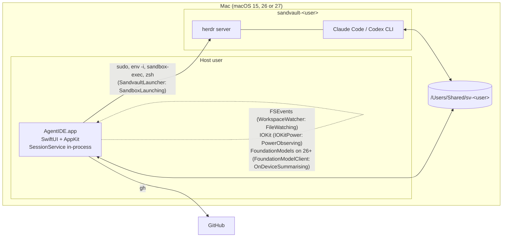
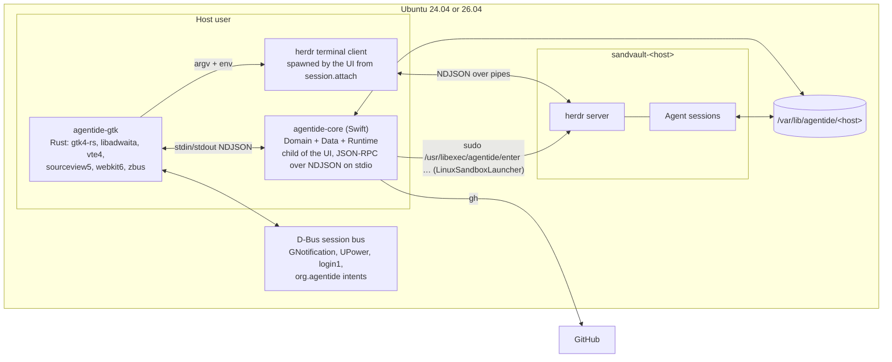
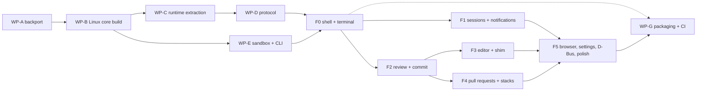

# AgentIDE multi-platform design and decisions

Prepared 2026-09-06 for the owner of a fork of MikeMcQuaid/AgentIDE,
against the local checkout at `/Users/pgiannopoulos/Repos/other/AgentIDE`
(HEAD `4f2855d` on `main`, plus the uncommitted working tree described
in §2). Paths are relative to that checkout unless absolute. The
companion documents are the executable macOS backport plan
(`2026-09-06-macos-15-backport-plan.md`) and the Linux work-package
roadmap (`2026-09-06-linux-roadmap.md`); names used here (work
packages WP-A to WP-G, protocol families, target and crate names) are
the names those two use.

## 1. What is being decided

The owner wants three things:

1. The macOS app to run on macOS 27 (Golden Gate), 26 (Tahoe) and 15
   (Sequoia). Today `Package.swift` and `project.yml` pin macOS 27.0
   (at HEAD; the working tree already lowers both to 15.0).
2. An Ubuntu desktop version with feature parity, as a separate native
   Linux UI over the same Domain/Data core.
3. An honest verdict on doing some or all of it in Rust.

Upstream is a single-maintainer project "designed exclusively for
@MikeMcQuaid's personal workflow" (`README.md` "Status" at HEAD), lists
"Windows or Linux support" as out of scope (`README.md` "Out of Scope"
at HEAD), and has landed 528 commits since 2026-08-01 (`git log
--since=2026-08-01`, checked 17:03 today), roughly 15 a day. Every
choice below is weighed against that: the fork must rebase cheaply and
should push anything neutral back upstream.

### Goals

- G1. One macOS binary that runs on 15, 26 and 27, with Liquid Glass
  and on-device drafting where the OS has them and honest fallbacks
  where it does not.
- G2. An Ubuntu app whose user-visible behaviour matches the 81
  surfaces in the parity catalogue (S1–S81), minus the losses listed
  in §8, over the same `AgentIDEDomain`, `AgentIDEData` and
  `AgentIDERuntime` code.
- G3. A core boundary that is language-neutral, so a Rust core could
  replace the Swift one later without touching the Linux UI.
- G4. A fork that rebases onto upstream weekly with conflicts confined
  to a known, small set of files, and that offers upstream every
  change that is neutral for macOS.

### Non-goals

- Windows. Nothing in the audit or catalogue was checked against it.
- Flatpak or Snap packaging (§7.6 says why).
- Replacing herdr, sandvault on macOS, or `gh`: they stay the sources
  of truth (`ARCHITECTURE.md` "Guiding principles" P1, P6).
- Routing the macOS app through the new core process. The SwiftUI app
  keeps calling `SessionService` in-process (§5.4).
- A Rust rewrite of the core now (§5.3 gives the triggers).

## 2. Baseline: HEAD plus an uncommitted, unreviewed scaffold

The working tree is not HEAD. At 17:03 today `git status --short`
listed 58 lines, `git diff --stat` 42 tracked files changed
(819 insertions, 532 deletions), and 17 untracked paths (plus
`.serena/`, a tool cache that must not be committed). The newest file
was written at 17:03:32 (`README.md`); the coordinator saw the tree
still changing at 18:23; at 19:48 the counts were unchanged. The
scaffold has no commits, no author recorded, and no review. This
document treats HEAD plus the scaffold as the baseline, verifies each
claim about it against the tree as read, and says where it must
change. Anything cited as "working tree" may differ from HEAD.

### 2.1 What the scaffold contains (verified by reading)

| Area | Working tree | State |
|---|---|---|
| Platform floor | `Package.swift:12` `platforms: [.macOS("15.0")]`; `project.yml:6,76,101` `15.0` | Done; matches the compile experiment |
| Mac-only gating of the manifest | `Package.swift` builds Domain, Data, Runtime, `agentide-core` and `AgentIDEDomainTests` everywhere; Feature, TerminalUI, App targets, their dependencies and their tests appended under `#if os(macOS)` | Done; the right shape for a Linux build |
| `AgentIDERuntime` target | `Sources/AgentIDERuntime/AgentIDERuntime.swift` (25 lines), `RefreshCoalescer.swift` (63 lines): the one-running-one-queued refresh state lifted out of `DashboardModel` (`Sources/DashboardFeature/DashboardModel+Refresh.swift` diff) | Done; small, correct, MainActor-bound |
| Seams in Data | `SandboxLaunching` (40 lines; `SandvaultLauncher` conforms and gains `loginShell`, `detachSuffix`, `profileBootstrap`, `sandboxPath`), `FileWatching` (15), `PowerObserving` (+ `PluggedInPower`, `IOKitPower` under `#if os(macOS)`), `OnDeviceSummarising` (+ `NullSummariser`), `PlatformRoots.detect()` with macOS and Linux branches | Done; `HerdrClient`, `SessionService` and `AppDependencies` take the protocols |
| Seams in Domain | `PreferenceStoring` (+ `UserDefaultsPreferences`), `StackSelection` reads it; `ModelAnswerParsing` holds the pure parsers `FoundationModelClient` used to own; `PerformanceLog.sharedTemporaryDirectory` injected from `AppDependencies` | Done |
| FoundationModels gate | `FoundationModelClient.swift` `#if canImport(FoundationModels)` plus `if #available(macOS 26, *)` around `respondWithFoundationModel` | Done |
| Swift 6.3 rename | `PullRequestStore.swift:239-249` `due` → `duePaths` | Done |
| Glass wrapper | `Sources/TerminalUI/GlassStyle.swift` (38 lines): `agentGlassButtonStyle()` / `agentGlassProminentButtonStyle()` choosing `.glass`/`.glassProminent` on macOS 26+ and `.bordered`/`.borderedProminent` below; all 11 sites replaced (App ×2, PRFeature ×4, ReviewFeature ×2, TerminalUI ×3; `grep -rn 'buttonStyle(.glass' App Sources` now hits only `GlassStyle.swift`) | Done |
| Drop handler | `App/RootView+Panes.swift:58-60` still `_ = dropFiles(...)` | Not done: still resolves to the macOS 26 overload |
| Linux compile blockers | `Quarantine.swift` xattr ABI gated `#if os(macOS)`; `NetworkMonitor`, `PowerSource`, `WorkspaceWatcher`, `SandvaultLauncher` gated | Three remain: `HerdrTerminalChannel.swift:48` `reading.bytes`, `SessionService+Edits.swift:134-147` `O_EVTONLY` and the vnode dispatch source, `ConversationBackup.swift:76` `url(forUbiquityContainerIdentifier:)`; also `Tests/AgentIDEDataTests/TestSupport.swift:3` `import Darwin` |
| Linux implementations | `LinuxSandboxLauncher` (80 lines), `InotifyWorkspaceWatcher` (153), `UPowerSource` (49, sysfs), `NetworkMonitor` Linux branch (always online) | Present; §2.2 lists defects |
| `agentide-core` | `Sources/AgentIDECore/AgentIDECore.swift` (105 lines): `@main` reading one JSON object per stdin line, answering `ping`, `roots`, `quit`; product `.executable(name: "agentide-core")` | A bridge proof, not a protocol |
| Linux sandbox tooling | `contrib/agentide-sandbox/{README.md,enter,install.sh,sudoers}` (253 lines): `useradd sandvault-<host>`, `/var/lib/agentide/<host>` mode 2770 with default ACLs, `enter` installed at `/usr/libexec/agentide/enter`, sudoers `<host> ALL=(sandvault-<host>) NOPASSWD: /usr/libexec/agentide/enter` | Present; §2.2 lists defects |
| Linux UI | `Linux/agentide.vala` (58 lines, Vala), `meson.build` (19), `README.md` (46): an `Adw.ApplicationWindow` with a `NavigationSplitView` that spawns `agentide-core`, sends `{"cmd":"ping"}` and shows `pong` | A bridge proof |
| CI | `.github/workflows/tests.yml` gains `build-macos15` (on the `xcode-27` runner, `swift build` of Domain, Data, Runtime with `-Xswiftc -target arm64-apple-macosx15.0`) and `linux-domain` (`ubuntu-24.04`, `swift-actions/setup-swift`, `swift test --filter AgentIDEDomainTests`) | Present; §2.2 lists defects |
| Documentation | `README.md`, `ARCHITECTURE.md`, `AGENTS.md` describe the scaffold: Requirements split into macOS (15+) and Ubuntu (24.04/26.04), a Linux system-context diagram, "Linux platform notes" | Present; some sentences describe the defects below as design |

### 2.2 Defects in the scaffold that the plans correct

Each was checked against the file named; none is speculative.

1. **`enter` kills the herdr server and breaks process accounting.**
   `contrib/agentide-sandbox/enter:117-121` passes bubblewrap
   `--die-with-parent` and `--unshare-pid`. The herdr server is
   started inside a launch and must outlive it (`HerdrClient.swift:144-169`
   starts it with the detach suffix and returns), so `--die-with-parent`
   ends the server with the launch. `--unshare-pid` makes herdr's
   `shell_pid` and `foreground_process_group_id` namespace-local, which
   breaks the host's `ps -axo pid,ppid` tree walk
   (`SessionService+Overview.swift:49-128`) and `pgrep -P`
   (`HerdrTerminalChannel.swift:87-110`). `ARCHITECTURE.md` (working
   tree, "Launching into the sandbox") documents these flags as the
   design; it must not. §7 gives the corrected argv.
2. **The Linux detach suffix is a bash syntax error.**
   `LinuxSandboxLauncher.swift:31` sets `detachSuffix = "&"`;
   `HerdrClient.swift:151` emits `herdr server &> <log> <suffix>; for …`,
   so bash sees `&;`, which it rejects ("syntax error near unexpected
   token `;'"). `& disown` is the bash spelling of zsh's `&!`.
3. **`InotifyWorkspaceWatcher` is a two-second mtime poller** of the
   roots and their first-level children
   (`InotifyWorkspaceWatcher.swift:84-90,166-183`), not inotify, and
   sees nothing two levels down (`worktrees/<repo>/<branch>`). It
   violates the performance principle "a poll that remains must say in
   a comment why no event can serve it" only by its comment's promise
   to be replaced; the roadmap's WP-B replaces it.
4. **`NetworkMonitor` on Linux always says online**
   (`NetworkMonitor.swift` Linux branch yields `true` once and
   finishes). Offline behaviour (`ServiceStatus`, the `OfflineError`
   funnel) is therefore untested on Linux.
5. **Battery awareness regressed for the service's pull request
   reads.** `PullRequestStore.swift:25` now defaults `onBattery` to
   `{ false }` (HEAD: `{ PowerSource.isOnBattery }`);
   `DashboardModel` passes its own closure, but
   `SessionService+PullRequests.swift:17-19` (`pullRequestReads`)
   builds a store with the default, so the feature models' reads no
   longer slow five-fold on battery.
6. **The `linux-domain` job cannot pass `script/style`**: it uses
   `swift-actions/setup-swift`, and `script/style:29-38` allows only
   `actions/*` and `Homebrew/actions/*`. It would also fail to build:
   `swift test` compiles every target in the manifest, and Data still
   has the three Linux compile blockers above.
7. **`build-macos15` proves little**: with the manifest already at
   15.0 the main `tests` job compiles everything at deployment 15, and
   this job builds only Domain, Data and Runtime on the same Xcode 27.
   What is missing is a job on a real macOS 15 with Xcode 26 (the
   owner's own toolchain generation), which the GitHub-hosted
   `macos-15` image provides (Xcode 26.3, 26.2, 26.1.1, 26.0.1
   installed beside the default 16.4; image macOS 15.7.9, read from
   `actions/runner-images` today).
8. **`LinuxSandboxLauncher.sandboxHome` is a literal**
   (`/home/sandvault-<host>`, `LinuxSandboxLauncher.swift:44-46`) as
   is `PlatformRoots.swift:62`; the audit's rule is to read the passwd
   entry (`getpwnam`), since `useradd --home-dir` is policy, not fact.
9. **The Linux launcher passes `-lc`** (`LinuxSandboxLauncher.swift:76`)
   while `HerdrClient.swift:156,186` build the in-sandbox argv as
   `[launcher.loginShell, "-c", payload]`; harmless, but the two
   shapes should agree so `FakeSandboxLauncherTests` can pin one.
10. **The app id `app.agentide.AgentIDE`** (`Linux/agentide.vala:32`)
    is a reverse-DNS name under a domain nobody in this fork owns;
    GNOME's D-Bus activation and GNotification key on it (§13, D12).
11. **`README.md` (working tree, "Requirements")** says "If a Sequoia
    host cannot load the Swift 6.4 stdlib, raise the floor to macOS
    26". Swift has been ABI-stable since 5.0; an app built with Xcode
    27 at deployment 15 uses the OS runtime and the compiler refuses
    any API newer than the floor without an availability check. The
    sentence should go.
12. **The two bridge proofs are not the design.** `agentide-core`
    answers three ad hoc commands with `ok` flags and no ids; the Vala
    shell sends one. Neither is wrong as a spike, but the contract in
    §6 replaces both shapes, and §5.2 decides the UI language.

What the scaffold gets right, and the plans keep: the manifest gating,
the six protocols, `PlatformRoots`, `RefreshCoalescer`, the
FoundationModels gate, the glass wrapper, the `due` rename, the sudoers
rule that names exactly one helper (tighter than sandvault's
`env`/`bash`/`true`), the shared-workspace ACL installer, and the
decision that `agentide-core` is a child the UI owns rather than a
resident daemon (§5.4 keeps that too).

## 3. The system today, in one paragraph

A SwiftUI macOS app (`App/`, composition root `App/AppDependencies.swift`)
over seven package targets. `AgentIDEDomain` (46 files, 4,151 lines)
is pure value types and parsers; `AgentIDEData` (80 files, 11,998
lines) is adapters composed by the `SessionService` facade (a struct
plus 20 extension files) with `GitClient`, `GitHubClient` (every
GitHub question through the host's `gh`), `HerdrClient`,
`HerdrTerminalChannel`, `PullRequestStore`, `MetadataStore` (one JSON
file), `TranscriptReader`; `TerminalUI` holds SwiftTerm, markdown and
tree-sitter; four Feature targets hold SwiftUI views and `@Observable`
MainActor models (`DashboardModel` 2,133 lines, `PullRequestsModel`
2,493, `ReviewModel` 685 with its views). Agents run as a separate
sandvault user inside a herdr server that user owns; the app derives
its whole view from herdr, git, transcripts and `gh`, persists only
`state.json`, and is killable at any moment losing nothing
(`ARCHITECTURE.md` "Overview"). 397 tests in 109 files.

## 4. Target architecture

### 4.1 macOS (after the backport)

Unchanged in shape. One binary, deployment target 15.0, built with
Xcode 27 (Swift 6.4) on CI and Xcode 26.3+ (Swift 6.3) on the owner's
machine; both toolchains are exercised by CI (§9, WP-A).



The four platform protocols and `PlatformRoots` are the only places
the two platforms diverge in Domain/Data. `GlassStyle.swift` is the
one place the two macOS generations diverge in the UI.

### 4.2 Ubuntu



Responsibilities:

| Component | Owns | Never does |
|---|---|---|
| `agentide-gtk` (Rust, `Linux/`) | Windows, widgets, VTE panes, the local shell PTY, the editor buffer, WebKitGTK, notifications, the D-Bus intent interface, GSettings, the request bus that replaces `@AppStorage` counters | Shell out to git, gh or herdr; read `state.json`; touch the sandbox home |
| `agentide-core` (Swift, `Sources/AgentIDECore`) | The JSON-RPC server over `SessionService`, `PullRequestStore`, `AgentIDERuntime`; the poll, the file watcher, the `herdr agent wait` watchers, notification decisions, `MetadataStore` | Draw anything; hold state herdr, git or GitHub own |
| herdr terminal client | The frame stream for one pane | — |
| `agentide-sandbox` (`contrib/agentide-sandbox`) | The sandbox user, sudoers, ACLs, template sync, `enter` | Anything after `exec bwrap` |

## 5. Core strategy

### 5.1 The three core options

| | A: Swift core, Swift GTK UI | B: Rust core (`agentide-core` in Rust, UniFFI into SwiftUI, gtk4-rs UI) | C: Swift core as a JSON-RPC process, Rust gtk4-rs UI |
|---|---|---|---|
| Core work | Seams + Linux implementations (≈ 1,780 lines in 17 Data files are platform-bound, audit §4.2) | Rewrite ≈ 16,150 lines of Domain and Data plus ≈ 6,800 lines of their tests; re-wire ≈ 120 public `SessionService`/`PullRequestStore` operations through FFI in the SwiftUI app | Same seams as A, plus a JSON-RPC layer over ≈ 120 operations |
| Linux UI work | Swift GTK bindings are immature and have no VTE, GtkSourceView or WebKitGTK bindings; three C shim libraries would have to be written and maintained | gtk4 0.11.4, libadwaita 0.9.2, vte4 0.10.0, sourceview5 0.11.2, webkit6 0.6.1, zbus 5.19.0 all published (crates.io, 2026-09-06) | Same as B |
| Upstream tracking | Rebase-friendly: additive seams | Ends it for the core: every one of upstream's Data changes (a third of ≈ 15 commits/day touch Data by the file list) is a manual re-port into Rust | Rebase-friendly: seams and an additive `Sources/AgentIDECore` |
| macOS app risk | None beyond the backport | Re-wiring the polished app onto FFI; two languages in the app; UniFFI callback interfaces for every stream (`HerdrTerminalChannel`, `pendingEdits`, `NetworkMonitor.changes`) | None: the app keeps `SessionService` in-process |
| Language-neutral boundary (G3) | No | Yes (UniFFI records) | Yes (the JSON-RPC schema) |
| Honest size | Core 4–6 ew; UI 35–50 ew and fragile | Core 20–30 ew; FFI wiring 4–6 ew; UI 25–37 ew | Core seams 4–6 ew; Runtime extraction 3–5 ew; protocol 5–8 ew; UI 25–37 ew |

Engineer-weeks (ew) assume one engineer fluent in Swift and Rust with
an Ubuntu machine beside the Mac; ranges are wide because the GTK
diff and terminal work (§8, catalogue §11) have no ready widgets.

**Recommendation: C.** It is the only option that keeps the macOS app
untouched beyond the backport, keeps the fork rebasing against 15
commits a day, gives Linux the strongest widget ecosystem, and still
satisfies G3. The review lead's provisional view stands; the two
objections it raised are answered honestly below rather than waved
away.

*The fat facade.* `SessionService` has ≈ 90 public operations across
`SessionService.swift` and 19 `SessionService+*.swift` files,
`PullRequestStore` 17, and the feature models also call `GitClient`
and `GitHubClient` directly (`DashboardModel` holds `github`;
`PullRequestsModel` and `ReviewModel` read diffs and facts). A
contract designed as a mirror of that surface would be wide and would
leak `gh`/git into the UI. §6.3 therefore designs the contract around
what a *pane* asks for, in eight families, and the roadmap's WP-D
first hoists the feature models' direct `GitClient`/`GitHubClient`
calls behind `SessionService` (an upstream-neutral refactor, since
the app's own "one client per external system" rule already wants
it). Cost: 5–8 ew, of which design is 1–2.

*The feature models are SwiftUI-bound.* `DashboardModel` imports
`UserNotifications` and `TerminalUI`, publishes through `@Observable`
and the `@AppStorage` bus (`pullRequestCacheGeneration`,
`dashboardRefreshRequest`), and holds the poll, the git-read
scheduling, the pull request tiers, the stack rota, the placeholder
rows and the notification decisions (`DashboardModel+Refresh`,
`+GitReads`, `+PullRequests`, `+Stack`, `+Cache`, `+Notifications`,
`+Sessions`, `+Host`). Under *any* option the Linux UI cannot run
that Swift. There are two ways out, and the choice is D5 in §13:
re-implement the reconcile loop in Rust against low-level core
methods (duplicated logic, two places to fix each bug, zero churn in
upstream's most-edited files), or move it into `AgentIDERuntime` so
the daemon hosts it and the Linux UI receives finished
`RepositoryGroup`s (one logic, but a deep refactor of `DashboardModel`
that upstream edits daily). The recommendation is the second, done
as the scaffold began it: `RefreshCoalescer` first, then the poll,
git reads, pull request tiers, stack rota and notification decisions
moved one extension file at a time with `DashboardModel` delegating
(WP-C, 3–5 ew). `PullRequestsModel` and `ReviewModel` are re-done
in Rust regardless: they are view state over service calls.

### 5.2 The three Linux UI routes

| | Vala + Meson (in the tree, `Linux/`) | Rust + gtk4-rs (asked for) | Swift over GTK |
|---|---|---|---|
| Bindings | Generated from GIR: complete for GTK4, libadwaita, VTE, GtkSourceView, WebKitGTK, libcanberra; zero friction | Generated from GIR by gtk-rs: gtk4 0.11.4, libadwaita 0.9.2, vte4 0.10.0, sourceview5 0.11.2, webkit6 0.6.1; libcanberra via `libcanberra-sys` or `gst` | adwaita-swift and kin: partial GTK4/libadwaita, no VTE, GtkSourceView or WebKitGTK; three hand-written C shims needed |
| Language fit | GNOME's own idiom; terse; GObject subclassing is natural | Strong types for the protocol (`serde`), testable models without a display, `tokio` for the JSON-RPC client; GObject subclassing through `glib::wrapper!` and `subclass` modules is verbose but routine | One language with the core, but the UI would be the only Swift GTK app of this size the ecosystem has; SwiftPM on Linux cannot use the GTK build plugins the bindings rely on |
| Community and hiring | Small; GNOME apps increasingly leave Vala for Rust | GNOME Circle's growth language; relm4 0.11 and libadwaita-rs actively released | Negligible |
| Path to option B | None: a Rust core would still talk to Vala over JSON | Direct: the `agentide-protocol` crate's serde types become the Rust core's types | None |
| Memory safety | GObject reference counting, no compiler guarantee | Rust | Swift |
| Tooling | `valac` diagnostics are weak; no formatter or linter of note | `cargo fmt`, `clippy`, `cargo test`, `cargo deny` for the AGPL compatibility check | `swift-format`; SwiftLint cannot see GTK |
| Proof in tree | 58 lines: window + `ping` over stdio | None yet | None |

**Recommendation: Rust with gtk4-rs (D2).** The Vala skeleton proved
the bridge in an afternoon, which is what a spike is for, and it is
the right thing to keep running until the Rust crate's first smoke
test (`core.hello` round trip) passes; then delete `Linux/agentide.vala`
and `meson.build` so there is one Linux UI. Rust wins on the protocol
types shared with a possible future core, on testability of the
re-implemented `PullRequestsModel`/`ReviewModel` logic, on tooling,
and on the owner's stated interest. Swift over GTK fails on bindings
alone: VTE, GtkSourceView and WebKitGTK are the three widgets the
catalogue's hardest surfaces (S24, S33/S34, S47, S49) stand on.

### 5.3 Rust core: deferred behind explicit triggers

Move to a Rust `agentide-core` only when one of these is observed and
written down, not on taste:

1. **Rebase cost**: conflicts inside `Sources/AgentIDEData` or
   `Sources/AgentIDEDomain` cost more than four engineer-hours a week
   for eight consecutive weeks, measured from the rebase log the fork
   keeps (§10).
2. **Toolchain**: a swift.org Linux toolchain regression or
   corelibs gap blocks a release for more than one release cycle and
   has no file-local workaround (the five known gaps all have one,
   audit §1.4).
3. **Deployment**: the core must run where Swift cannot (a
   musl-static build, an architecture swift.org does not ship).
4. **Strategy**: the owner decides to stop tracking upstream (a hard
   fork). Then the reason C exists disappears and the core language
   is a free choice.
5. **Measured performance**: the Swift daemon's idle RSS or spawn
   latency fails a stated budget on the target hardware and profiling
   attributes it to the runtime rather than to the code.

Until then the JSON-RPC contract (§6) is the insurance policy: the
Rust UI never learns which language answers it.

### 5.4 Child process or daemon

The scaffold makes `agentide-core` a child the UI owns over stdio
(`AgentIDECore.swift:15-52`; `AGENTS.md` working tree, "Linux
platform notes": "not a lingering daemon"). The review lead's option
C names a daemon on a Unix socket in `$XDG_RUNTIME_DIR`. Compared:

| | Child over stdio | Daemon on `$XDG_RUNTIME_DIR/agentide/core.sock` |
|---|---|---|
| Lifecycle | Dies with the UI; no stale socket, no version skew between UI and core, no second instance | Needs start-on-demand, liveness probe, stale-socket cleanup, version handshake across restarts |
| Clients | One (the UI) | Many: the UI, `bin/agentide`, a D-Bus intent service |
| Fit with the thesis | Exact: "AgentIDE holds no session-critical state" (herdr does), so nothing needs the core to outlive the window; shells and browser pages already die with the app | Adds a resident process the design has so far avoided ("There is no daemon or launchd unit", `ARCHITECTURE.md` "herdr") |
| Security | Pipe inherited by one process | Socket in a 0700 directory; still per-user |
| Hot path | Frames do not pass through it (§6.6) | Same |

**Keep the child (D3).** The framing in §6 is transport-agnostic (one
JSON object per line, ids on requests), so a `--listen <path>` flag
can add the socket later for the one plausible second client, the
`agentide` command, whose spool protocol (`~/.agentide/edits`) works
unchanged on Linux in the meantime.

## 6. The `agentide-core` protocol

### 6.1 Transport and framing

- Transport: the UI spawns `agentide-core` with stdin and stdout as
  pipes and stderr inherited (so crashes and the performance log's
  complaints land in the UI's journal). Optional later:
  `agentide-core --listen <path>` serving the same messages on a Unix
  socket (D3).
- Framing: newline-delimited JSON, one object per line, UTF-8, no
  embedded newlines (the same rule as herdr's terminal stream and the
  scaffold's bridge). Lines over 16 MiB are refused with error
  `-32600`.
- Envelope: JSON-RPC 2.0. Requests carry `"jsonrpc":"2.0"`, an
  integer `id`, `method`, `params` (always an object). Responses carry
  `id` and `result` or `error`. Server-to-client notifications carry
  `method` beginning `event.` and no `id`. Client-to-server
  notifications: `$/cancel {id}` only.
- Ordering: requests may be answered out of order (each is a Swift
  `Task`); the writer is one actor so lines never interleave, the same
  discipline as `HerdrTerminalChannel.send`.
- Cancellation: `$/cancel {id}` cancels the request's `Task`; the
  cancelled request still answers, with error code 1006, so the client
  can forget it.
- Unknown fields are ignored on both sides, and unknown `event.`
  methods are dropped by the client, the rule `HerdrTerminal.parse`
  already follows (`Sources/AgentIDEDomain/HerdrTerminal.swift:53-75`).

### 6.2 Handshake and versioning

The first request is `core.hello`:

```json
{"jsonrpc":"2.0","id":1,"method":"core.hello","params":{"protocolVersion":1,"client":"agentide-gtk 0.1.0","capabilities":["notifications","terminal.direct"]}}
{"jsonrpc":"2.0","id":1,"result":{"protocolVersion":1,"core":"agentide-core 0.9.1+fork.12","flavour":"production","capabilities":["progress","cancel","schema"]}}
```

`protocolVersion` is a single integer. Additive changes (new methods,
new optional fields, new event kinds) do not bump it; a removed or
retyped field does. The core refuses a client whose major is higher
with error `-32600` and a message naming both versions. `flavour` is
`production` or `development` and decides the herdr session name
(`agentide` or `agentide-dev`, `HerdrClient.swift:92`), replacing the
`/Applications/AgentIDE.app` prefix test in `WorkspacePaths.swift:31`
on Linux (audit #4).

`agentide-core schema` (a subcommand, the way `herdr api schema`
works) prints the JSON Schema for every method's params and result and
every event, generated from one hand-maintained
`Protocol/agentide-core.schema.json` in the fork. Both sides test
against it: Swift encodes fixture values and validates them; the Rust
`agentide-protocol` crate decodes the same fixtures in `cargo test`.
Domain value types cross as their `Codable` JSON with Swift's default
camelCase keys; the Rust side uses `#[serde(rename_all = "camelCase")]`.

### 6.3 Method families

Named `<family>.<verb>`; every method's params include the identifying
path (`worktreePath` or `repositoryPath`) so the core never keeps a
"current selection" of its own except where the app already persists
one (`selectedWorktreePath`, which the UI owns in GSettings).

| Family | Methods | Backed by |
|---|---|---|
| `core` | `hello`, `roots` (the `PlatformRoots` record, for Settings › Advanced and for opening paths), `settings.get`/`settings.set` (the ten `AppSettings` keys, so cadence and locations stay core-owned), `shutdown` | `PlatformRoots`, `AppSettings` |
| `sidebar` | `groups` (the current `[RepositoryGroup]`, cached sidebar first), `refresh {force: [repositoryPath], readPanes}`, `select {worktreePath}` (marks seen, forces that repository's next read), `markUnread`, `acknowledge` | `AgentIDERuntime` (WP-C), `SessionService.markSeen/markUnread/acknowledgeActivity` |
| `session` | `create {repositoryPath, source: prompt|issue|pullRequest, prompt, number, agent, model, effort, progressToken}`, `resume {worktreePath, progressToken}`, `resumePast {past, worktreePath}`, `resumeInNewWorktree {past, repositoryPath}`, `close {sessionName, worktreePath}`, `kill {sessionName}`, `typeText`, `readOutput`, `attach {sessionName}` → `{argv, environment, bracketsPastes, palette}`, `stageDroppedFile {path}`, `past {worktreePath}`, `transcript {past}`, `deleteConversation {past}`, `overviews`, `launchChoices {agent}`, `publishChoices`, `probeVersion {agent}`, `shellEnvironment` | `SessionService+Sources/+Resuming/+Sessions/+Overview/+Models/+Edits`, `HerdrClient.attachCommand` |
| `worktree` | `delete`, `cleanUpMerged {baseRef}`, `fetch`, `fetchAndReset`, `availableBranches`, `switchBranch`, `checkoutAndPullDefault`, `hostDirectory.add`, `hostDirectory.forget`, `stack`, `stack.exclude {branch, excluded}`, `stack.branch {name}`, `restack`, `pushStack`, `branchesOutOfPlace`, `branchesUnpushed`, `branchesUnsigned` | `SessionService+Lifecycle/+Host/+Stack` |
| `repository` | `list`, `delete`, `owners`, `repositories {owner}`, `clone {fullName, progressToken}`, `openIssues`, `openPullRequests`, `defaultBranch` | `SessionService+Sources/+Lifecycle/+PullRequests` |
| `review` | `diff {worktreePath, scope: uncommitted|lastCommit|upstream|branch|commit, commit, ignoringWhitespace, stackBranch}`, `branchCommits`, `replaceLine {file, line, text}`, `rejectLines {selection}`, `deleteUntracked {file}`, `commit {paths, message}`, `amend {paths, message}`, `commitOutstanding`, `draftCommitMessage`, `changedLineNumbers {file}`, `editorConfig {file}`, `listFiles`, `search {query}`, `trackedFile {path}` | `SessionService+Sessions/+Sources/+EditorConfig`, `GitClient+Diffs/+Commits/+Committing` hoisted behind the service in WP-D |
| `pullRequests` | `listing {repositoryPath, scope: branch|mine|open, branch, page}`, `summary {number}`, `conversation {number}`, `create {…, draft}`, `edit {number, title, body}`, `labels`, `editLabels`, `markReady`, `markDraft`, `merge`, `automerge`, `disableAutomerge`, `queue`, `resolveThread {id}`, `unresolveThread`, `reviewsText {number}`, `failingChecksText {number}`, `push {worktreePath}`, `rebaseNeed`, `rebaseSigned`, `pushDestination`, `isTipSigned`, `commitMessages {range}`, `draftDescription`, `template`, `fillTemplate`, `linkStack`, `mergeStack {number}`, `invalidate {number}`, `hasMergeQueue`, `queuedNumbers` | `PullRequestStore`, `SessionService+PullRequests/+Rebase/+Stack`, `GitHubClient+Runs/+Threads/+Labels` hoisted behind the service |
| `edits` | `pending` (answers the current spool), `claim {edit}`, `finish {edit, saved}`, `discard {edit}` | `SessionService+Edits`, `ExternalEditSpool` |

Roughly 110 methods. Each is a decode → call → encode function of a
few lines; the substance is in the hoisting refactor and the schema.

### 6.4 Events (server → client notifications)

| Event | Payload | Source |
|---|---|---|
| `event.groups` | `{groups: [RepositoryGroup]}` whenever a reading changed something user-visible (row equality decides, as today) | `AgentIDERuntime` |
| `event.agent` | `{worktreePath, sessionName, activity}` the moment `herdr agent wait` returns | the runtime's watcher tasks |
| `event.notification` | `{kind: finished|needsInput|output, repositoryName, branch, worktreePath}` — the *decision*, made once per worktree per reading by the same rules as `DashboardModel+Notifications`; the UI decides how to show it (GNotification, libcanberra, badge) | `AgentIDERuntime` |
| `event.progress` | `{token, step}` with the exact `LaunchReporter` string, backticks included, so the GTK `LaunchProgressView` port renders the same words | every method taking `progressToken` |
| `event.edit` | `{edit: ExternalEdit}` when the spool gains a request | `SessionService.pendingEdits` |
| `event.message` | `{isFailure, repositoryName, branch, text, at}` — every line `ErrorLog` receives today, since `ErrorLog` lives in `TerminalUI` and the core needs its own sink | a `MessageSink` the daemon installs |
| `event.status` | `{network: online|offline, github: ok|outage, since}` | `NetworkMonitor`, `GitHubOutage` |
| `event.pullRequestCache` | `{repositoryPath, number}` when a pane wrote a cache the rows read (the `pullRequestCacheGeneration` bus, made explicit) | `PullRequestStore+Remembering` |

### 6.5 Progress, errors and refusals

Long operations (`session.create`, `session.resume*`,
`repository.clone`, `pullRequests.push`, `worktree.restack`) take a
client-chosen `progressToken` string; the core creates a
`LaunchReporter` closure that emits `event.progress` for that token
and hands it to the service call, so the step strings are the
existing ones ("Creating the worktree…", "Waiting for herdr to see the
agent settle"). The response arrives after the last step.

Errors use the JSON-RPC `error` object. Standard codes for framing
(`-32700` parse, `-32600` invalid request, `-32601` unknown method,
`-32602` bad params, `-32603` internal). Application codes:

| Code | Meaning | Swift origin |
|---|---|---|
| 1000 | offline | `OfflineError` |
| 1001 | git failed | `GitClient` errors, `ProcessResult` non-zero |
| 1002 | gh failed | `GitHubClient.gh` failures |
| 1003 | herdr failed | `HerdrClient` errors, server unreachable |
| 1004 | refused by policy | `SessionService.CleanupRefusal` (`dirty`, `unmerged`), a path outside the shared workspace, an unsigned tip |
| 1005 | gone | worktree or session no longer exists |
| 1006 | cancelled | `$/cancel` |

`error.data` always carries `{repositoryName, branch, detail}` and,
for 1004, `refusal`, so the UI writes the Messages line in the app's
one shape, `repository: \`branch\`: what happened`, and switches to
the Messages tab on a failed footer action exactly as today.

### 6.6 The terminal channel passes beside the protocol, not through it

`session.attach` returns the argv `HerdrClient.attachCommand(paneID:)`
already builds (`HerdrClient.swift:103-121`: `sudo … herdr terminal
session control <pane> --takeover`), the scrubbed environment
(`ProcessEnvironment.scrubbed`, `ProcessRunner.swift:89-93`), and the
palette recorded at launch (`SessionService.launchAppearance`). The
UI spawns that child itself and speaks herdr's own NDJSON
(`terminal.frame`, `terminal.closed` in; `terminal.input`,
`terminal.resize`, `terminal.scroll` out;
`Sources/AgentIDEDomain/HerdrTerminal.swift`) straight into VTE. Frames
therefore never cross the core, the core is never on the keystroke
path, and a core restart never drops a pane. The local shell pane is
UI-owned entirely (VTE spawns the host user's login shell with
`session.shellEnvironment`). The Rust `agentide-protocol` crate
carries the herdr terminal record types too, so there is one place
that knows both wire formats.

### 6.7 Lifecycle

```mermaid
sequenceDiagram
    participant UI as agentide-gtk
    participant Core as agentide-core
    participant H as herdr (sandbox user)
    UI->>Core: spawn (stdio pipes)
    UI->>Core: core.hello
    Core-->>UI: result {protocolVersion, flavour}
    UI->>Core: sidebar.groups
    Core-->>UI: cached groups (first paint from state.json)
    Core->>H: herdr api snapshot (through enter)
    Core-->>UI: event.groups (live)
    UI->>Core: session.create {progressToken:"t1"}
    Core-->>UI: event.progress {t1, "Creating the worktree…"}
    Core->>H: workspace create, pane run
    Core-->>UI: result {sessionName, paneID}
    UI->>Core: session.attach
    Core-->>UI: {argv, environment, palette}
    UI->>H: spawn herdr terminal session control --takeover
    H-->>UI: terminal.frame …
    Note over UI,Core: UI exits → stdin closes → core exits; herdr and agents keep running
```

## 7. The Linux sandbox (WP-E)

### 7.1 Shape, kept from the scaffold

A dedicated unprivileged user `sandvault-<host>`; a shared workspace
`/var/lib/agentide/<host>` (mode 2770, default POSIX ACLs `rwX` for both
users) with the macOS layout (`repositories/`, `worktrees/<repo>/<branch>/`,
`agentide/{prompts,events,session-defaults,host-directories}`, `user/`,
`tmp/`); one sudoers line, `<host> ALL=(sandvault-<host>) NOPASSWD:
/usr/libexec/agentide/enter`, tighter than sandvault's `env`, `zsh` and
`true`; confinement by bubblewrap inside `enter`. `LinuxSandboxLauncher`
builds the argv `sudo --login --set-home --user=sandvault-<host>
/usr/libexec/agentide/enter --home=… --shared=… --workdir=… --session-id=…
--session-name=… -- /bin/bash -c <payload>`.

### 7.2 What changes (defects 1, 2, 8, 9 in §2.2)

- `enter` drops `--die-with-parent` and `--unshare-pid`. The corrected
  bubblewrap argv keeps `--new-session --unshare-ipc --unshare-uts`, the
  read-only binds of `/usr`, `/bin`, `/sbin`, `/lib*`, `/etc/ssl`,
  `/etc/resolv.conf`, `/etc/passwd`, `/etc/group`, `/etc/nsswitch.conf`
  and `/home/linuxbrew`, the read-write binds of the sandbox home and the
  shared workspace, `--tmpfs /tmp`, `--proc /proc`, `--dev /dev`, and never
  binds the host's home. The herdr server started by `HerdrClient.ensureServer`
  therefore outlives its launch, and herdr's pids stay meaningful to the
  host's `ps` and `pgrep`.
- `LinuxSandboxLauncher.detachSuffix` becomes `& disown` (bash rejects
  `&;`); `profileBootstrap` becomes `. ~/.profile; . ~/.bashrc;`;
  `sandboxHome` is read from the passwd entry (`getpwnam`), not a literal;
  the in-sandbox shell argv is `[loginShell, "-c", payload]` everywhere so
  `FakeSandboxLauncherTests` pins one shape.
- `install.sh` adds default read ACLs (`u:<host>:rX`) on `~sandvault/.claude`
  and `~sandvault/.codex` and `x` on the home (transcripts are read as the
  host), `rwX` under `~sandvault/.claude/projects` for
  `resumeInNewWorktree`, `safe.directory = /var/lib/agentide/<host>/*` in the
  host's gitconfig, and a login hook that syncs the shared `user/` template
  into the sandbox home (the Claude Code hooks `HookInstaller` writes live
  there).
- The installer self-tests `sudo -u sandvault-<host> bwrap --ro-bind / /
  true`; on Ubuntu 24.04 and later unprivileged user namespaces are
  restricted by AppArmor, and the fix is the shipped `bwrap-userns-restrict`
  profile. If that cannot be enabled, `enter` falls back to a Landlock
  ruleset (kernel 5.13 or later) applied by a small helper before `exec`,
  which needs no namespaces at all.

## 8. What Linux gives up, and the preferences bus

Accepted losses, stated so nobody plans around them: window position and
display restore (Wayland compositors own placement; size and fullscreen
are kept); Siri and App Intents (replaced by a D-Bus interface with
`StartSession`, `ShowWorktree`, `OpenPullRequests` and `WhatNeedsMe`, plus
matching `agentide` subcommands); the on-device model (`NullSummariser`;
an Ollama adapter behind `OnDeviceSummarising` is optional later); iCloud
conversation backup (`$XDG_DATA_HOME/agentide/conversations`); per-page
WebKit process ids in the session manager; the Dock badge is best-effort
through the Unity LauncherEntry D-Bus signal, honoured by Ubuntu's dock.

The macOS app carries 56 `UserDefaults` keys across targets, 13 of them
request counters. In `agentide-gtk` every counter is a `GAction` or a
signal and every persisted value a GSettings key; the values the CLI and
the window share (`agentKind`, `agentModel`, `agentEffort`) keep travelling
through `agentide/session-defaults` in the shared workspace; the ten
`AppSettings` keys are core-owned through `core.settings.*` (§6.3) so
cadence and locations mean the same thing to both front ends.
`state.json` ports unchanged to `$XDG_STATE_HOME/agentide/state.json`.

## 9. Decomposition, ordering and effort

| Package | Scope | Depends on | Engineer-weeks |
|---|---|---|---|
| WP-A | macOS 15/26/27 backport: the executable plan; QA on three OS versions; CI on `macos-15` with Xcode 26 | — | 1–2 |
| WP-B | Linux core build: the three remaining corelibs blockers, the `/tmp` temp-file fix, `%cpu` sampling from `/proc`, a real inotify `FileWatching`, `NetworkMonitor` on Linux, the `linux-domain` job made compliant and extended to Data | WP-A | 4–6 |
| WP-C | Runtime extraction: the poll, git-read scheduling, pull request tiers, stack rota and notification decisions move from `DashboardModel` into `AgentIDERuntime`, one extension file at a time, with the Mac model delegating | WP-B | 3–5 |
| WP-D | Protocol: hoist the feature models' direct `GitClient`/`GitHubClient` calls behind `SessionService`; the JSON-RPC server in `Sources/AgentIDECore`; `Protocol/agentide-core.schema.json`; the Rust `agentide-protocol` crate with fixture tests on both sides | WP-C | 5–8 |
| WP-E | Linux sandbox tooling (§7) and the `bin/agentide` port (`reexec_in_sandbox`, uuid fallback, no bundle walk) | WP-B | 1–2 |
| WP-F | `agentide-gtk` in six phases: F0 window, sidebar from `sidebar.groups`, one herdr-fed VTE pane (S1–S11, S24); F1 new-session flow, launch narration, notifications, sounds, badge (S19–S23, S58); F2 review and commit (S29–S38); F3 editor and edit-shim hand-off (S45–S48); F4 pull requests and stacks (S39–S44, S15, S30); F5 browser, settings, D-Bus interface, session manager, policy polish (S49–S57, S59–S71, S72–S81) | WP-D, WP-E | 25–37 (F0 3–4, F1 2–3, F2 4–6, F3 4–6, F4 6–8, F5 6–10) |
| WP-G | Packaging and release: `.deb` per architecture (`cargo-deb` for the UI, `agentide-core` with `--static-swift-stdlib`), tarball, the CI matrix (`xcode-27`, `macos-15`, `ubuntu-24.04` core and UI), release notes | WP-F F0 onwards, final at F5 | 1–2 |



Roughly 40–60 engineer-weeks after WP-A for parity, with F2–F4 carrying
the risk the catalogue names (the editable diff and the editor have no
ready widgets). WP-A alone is a week's work and unblocks the owner's own
machine. The `.deb` can ship after F0 as a preview and after F5 as parity.

## 10. Fork and upstream strategy

- Branch `linux` in the fork, rebased onto upstream `main` weekly. Keep
  a rebase log (`docs/superpowers/rebase-log.md`: date, conflicts by file,
  minutes spent); it is the measurement trigger 1 in §5.3 reads.
- Linux code stays in files upstream never touches
  (`Sources/AgentIDECore`, `Sources/AgentIDEData/Linux*.swift`,
  `InotifyWorkspaceWatcher.swift`, `UPowerSource.swift`, `contrib/`,
  `Linux/`, `Protocol/`), and the seams stay small, so rebases stay cheap.
- Propose upstream, as separate pull requests, only what is neutral for
  the Mac: the macOS 15 floor with the glass wrapper, the FoundationModels
  gate and the `due` rename (README says 27 or later, so upstream may
  decline; the change is small and self-contained); the six seams and
  `PlatformRoots`; the `BrowserPanes` guard order; the hoisting of direct
  `GitClient`/`GitHubClient` calls behind `SessionService` (the app's own
  P6 wants it). Never propose the Linux implementations or the runtime
  extraction until upstream asks.
- Every proposal follows AGENTS.md: sentence-case imperative commit
  messages, `script/style --fix`, `script/test`, `script/analyze` on the
  host, README and ARCHITECTURE updated in the same commit.

## 11. Licence

AGPL-3.0 for every component of the fork, `agentide-gtk` and
`agentide-protocol` included. The process boundary does not change the
answer, and one licence avoids the question. `cargo deny` checks that
the Rust dependency tree stays AGPL-compatible.

## 12. Risks

| Risk | Mitigation |
|---|---|
| swift-corelibs behaviour differs from Darwin Foundation in ways tests do not catch | From WP-B on, run the Domain and Data suites on `ubuntu-24.04` in CI; herdr's Linux binary lets the integration suites run there too |
| bubblewrap blocked by AppArmor on the target release | Installer self-test; the shipped profile; the Landlock fallback (§7.2) |
| Upstream restructures `SessionService` or `DashboardModel` and the runtime extraction or protocol adapter drifts | Adapters wrap calls and never re-implement them; fixture tests through the child process fail on rebase, not in use; the rebase log surfaces the cost |
| The editable diff and editor cannot reach parity on GtkSourceView | Prototype S33/S34 and S47 first in F2 and F3, before footers and forms |
| Two agents editing one checkout (observed during this review) | One writer per branch; Linux work in its own worktree |
| The protocol grows to mirror the facade instead of the panes | The eight families in §6.3 are the contract; a new method needs a pane that asks for it |
| Fifteen upstream commits a day | Weekly rebase cadence with the CI matrix as the gate; triggers in §5.3 decide when to stop tracking |

## 13. Decisions for the owner

| Id | Decision | Recommendation |
|---|---|---|
| D1 | Core strategy | Option C: keep the Swift core, expose it from `agentide-core`, build the Linux UI on it |
| D2 | Linux UI language | Rust with gtk4-rs; delete the Vala skeleton once `core.hello` round-trips from Rust |
| D3 | Core process model | A child the UI owns over stdio; `--listen` for a socket only if a second client needs it |
| D4 | Ubuntu floor | 24.04 LTS; add 26.04 when it ships |
| D5 | Where the reconcile loop lives | In `AgentIDERuntime` (WP-C), not re-implemented in Rust |
| D6 | Packaging | `.deb` and tarball; no Flatpak or Snap |
| D7 | `enter` flags | Remove `--unshare-pid` and `--die-with-parent` (§7.2) |
| D8 | Confinement fallback | Landlock helper when bubblewrap's user namespaces are blocked |
| D9 | Upstream proposals | Backport and seams after the QA matrix passes; Linux code never |
| D10 | Licence | AGPL-3.0 throughout |
| D11 | The uncommitted scaffold | Review it, fix the defects in §2.2, commit it as "Phase 0" on `linux`; never leave two agents writing one checkout |
| D12 | Application id | Replace `app.agentide.AgentIDE` with a reverse-DNS name the owner controls (for example `io.github.<owner>.AgentIDE`); GNotification and D-Bus activation key on it |

## 14. Evidence and status

Review reports in the session scratchpad `review/`: `00-lead-findings.md`,
`01-compile-tests.md`, `core-portability-audit.md`, `ui-parity-catalogue.md`,
`backport-ui-audit.md`, and `code-quality-review.md` (fourteen findings,
one high, written before the reviewing agent stalled; low-severity findings
and its "done well" section were not written). `backport-build/` holds the
scratch copy and every build and test log.
